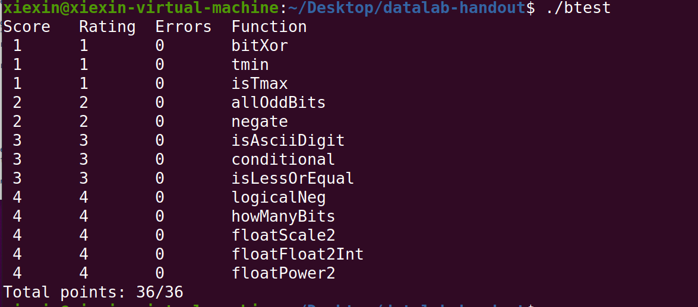

# Datalab
## 总结
这个实验主要就是要掌握数据的位级表示，以有限的、较简单的运算实现较复杂的功能。

## 注意
本笔记是边做lab边写的，部分代码是错误的，后来在.c文件中直接改正了，在这里没有同步修改，请读者注意。
## 未解之谜
isTmax：自己写的解法在自己机器上可以正确运行，但是用实验给的测试工具测出来不行，很奇怪。
## 主要收获
1，熟练数据的位级表示。
2，训练模块化编程思维：把一个较复杂的问题分解成若干较简单的子问题。
3，位级操作不直观，更加需要细心编写代码。
### 主要实验要求
整数规则：
整数常量范围是0~255；
只能使用单元运算符 ！~，以及二元运算符& ^ | + << >>
不能使用任何控制结构；
不能定义额外函数、调用函数；
不能用除了int以外的数据类型。

浮点规则：
允许使用循环、条件；
允许使用int和unsigned变量，并且可以进行任意算术、逻辑、比较运算；
允许使用任何浮点数据类型；
不能使用数组、结构体、联合；
不能定义额外函数、调用函数；

每个fuction限制了最大的operations数目（包括整数运算、逻辑运算、比较运算）；
赋值语句不算operation的数目；

### 题目1
用取反和与实现异或。
异或就是，一样的位是0，不一样的位是1.
用逻辑表达式变换一下即可。
```C++ {.line-numbers}
int bitXor(int x, int y) {
  return ~(~x & ~y) & ~(x&y);
}
```

### 题目2
给出int的最小值。
```C++ {.line-numbers}
int tmin(void) {

  return 1<<31;

}
```

### 题目3
返回x是否是int的最大值。
额，编译的时候才发现不让用移位。
想了一会想不出来，查答案，答案给的是如何判断Tmin，显然把x+1就把问题转换为了判断是否是Tmin。
判断Tmin，Tmin的特征是只有最高位是1，那么把Tmin和自己相加，看是否为全0即可。只有Tmin和全0会出现加自己变成了全0.所以再排除全0的情况即可。
```C++ {.line-numbers}
int isTmax(int x) {
  return !(((1<<31>>31)^x)+1);
}
```

### 题目4
返回1，如果x的奇数位全是1.
```C++ {.line-numbers}
int allOddBits(int x) {
    int aaaa = ((0xAA << 8) | 0xAA);
    int aaaaaaaa = (aaaa << 16) | aaaa;
  return !((aaaaaaaa&x)^aaaaaaaa);
}
```

### 题目5
返回负数。
```C++ {.line-numbers}
int negate(int x) {
  return ~x+1;
}
```

### 题目6
判断值是否在某个范围。
```C++ {.line-numbers}
int isAsciiDigit(int x) {
    // x>>4 ^ 0x3：如果结果不是全0，则肯定不行，此表达式非0则返回0
    //现在只需考虑低4位
    // x&0x8：是0则肯定行
    //如果上式是1，要求x&0x6必须是0。
    return !(((x>>4)^0x3) |(((x>>3) & 0x1)&(((x>>2)&0x1)| ((x >> 1) & 0x1))));
}
```

### 题目7
实现正则表达式。
```C++ {.line-numbers}
int conditional(int x, int y, int z) {
    //先把x转换成条件
    int boolx = !!x;
    int flagx = boolx << 31 >> 31;
    return (y & flagx) | (z & (~flagx));
}
```

### 题目8
实现小于等于。
```C++ {.line-numbers}
int isLessOrEqual(int x, int y) {
    //异号特别处理，同号用减法
    //注意y是tmin的特殊情况
    int sign_x = x >> 31;
    int sign_y = y >> 31;
    int flag_y = y ^ (1 << 31);
    int flag_x = x ^ (1 << 31);
    int diff=x + (~y + 1);
    int sign_diff = diff >> 31;
    return ((!(((sign_diff & (x ^ y)) | (sign_x & !sign_y)) & (sign_x | ~(sign_y)))) & (!!flag_y)) | (flag_y | (flag_y ^ flag_x));
}
```

### 题目9
实现逻辑非。
```C++ {.line-numbers}
int logicalNeg(int x) {
  return ((x|(~x+1))>>31)+1;
}
```

### 题目10
返回需要多少位来表示x。
正数是看x里最高位的1是第几位，负数是看x里最高位的0是第几位。
不太会，查了答案以后百思不得其解，主要纠结的问题是，比如对第一重，答案直接右移16位，但是假如第16位是1，那就检测不到这位，8+4+2+1最多等于15.
想了一会，终于想明白，我误以为答案的思路是用二进制表示法来划分，其实不是这么理解。算法是二分查找。最后计算是第几位的方法是，看为了找这个最高位总共移了多少位，比较特殊的是最后一重，x>>1之后，如果x还是1，说明其实还需要再移1位，就是要再+1，如果x是0，说明x>>1就找到了，那就是移位总数，所以最后再加上(x>>1)即可。
```C++ {.line-numbers}
int howManyBits(int x) {
    int sign = x >> 31;
    x = (sign & ~x) | (~sign & x);
    int b16 =( !!(x >> 16))<<4;//高16位是否有1
    x = x >> b16;
    int b8 =( !!(x >> 8))<<3;//检查子8位
    x = x >> b8 ;
    int b4 = (!!(x >> 4)) << 2;
    x = x >> b4;
    int b2= (!!(x >> 2)) << 1;
    x = x >> b2;
    int b1 = (!!(x >> 1));
    x = x >> b1;
    b0 = x;
    return b16 + b8 + b4 + b2 + b1 + b0+1;
}
```

### 题目11
实现浮点数*2。
规格化数很简单，让exp字段+1。
对于非规格化数（阶码全0），把除了符号位s以外的字段都左移1位。
对于特殊值（阶码全1），保持不变。
```C++ {.line-numbers}
unsigned floatScale2(unsigned uf) {
    //先获得exp字段
    unsigned exp = (uf << 1 >> 24);
    int tmin = 1 << 31;
    int mask = ~tmin;
    unsigned s = uf & tmin;
    if (!(exp ^ 0xff))//exp全1
        return exp;
    if (!exp)//exp全0
        return ((uf << 1) & mask) | s;
    exp = exp + 1;
    unsigned frac = uf << 9 >> 9;
    return frac | (exp << 23) | s;
}
```

### 题目12
实现float2int。
非规格化数肯定转成0。
特殊值转为0x80000000。
规格化数，计算出阶码的值E,提取符号位，将frac向右移动23-E位。
难点是右移会舍去一部分数据，怎么舍入？
思考一番过后，可以把会舍去的部分单独存起来，超过1/2就需要舍入。
注：答案给的做法明显错误，对于某一用例，尾数全1，E是126-127=-1，float是一个很接近2的数乘1/2，转int结果肯定应该是1，测试说答案应该是0......
显然实验设计者设计这个答案时没考虑舍入。
再注：白考虑这么复杂了，发现C语言的float转int标准实现就是不用四舍五入的，直接舍掉小数值。
```C++ {.line-numbers}
//正确做法
int floatFloat2Int(unsigned uf) {
    //先获得exp字段
    int tmp, Bias, E, yiwei;
    unsigned baoliu, jizhun, exp, yc, frac, s;
    exp = (uf << 1 >> 24);
    yc = 1 << 31;
    Bias = 127;
    E = exp - Bias;
    frac = uf << 9 >> 9;
    s = yc & uf;
    yiwei = 23 - E;
    if (!exp)
        return 0;
    if (exp==0xff)
        return yc;
    frac = frac | (1 << 23);
    //基准：当E=0时，右移23位，所以右移23-E位
    //先处理左移
    if (yiwei < 0)
    {
        yiwei = -yiwei;
        if (yiwei >= 8)
            return yc;
        frac = frac << yiwei;
    }
    else
    {
        if (yiwei >= 25)
            return 0;
        tmp = 32 - yiwei;
        baoliu = frac << tmp >> tmp;
        jizhun = 1 << (yiwei - 1);
        frac = frac >> yiwei;
        if (baoliu > jizhun)
            frac = frac + 1;
        else if (baoliu == jizhun)
            if (frac & 1)
                frac = frac + 1;
    }
    if (s)return ~frac + 1;
    return frac;
}
```
